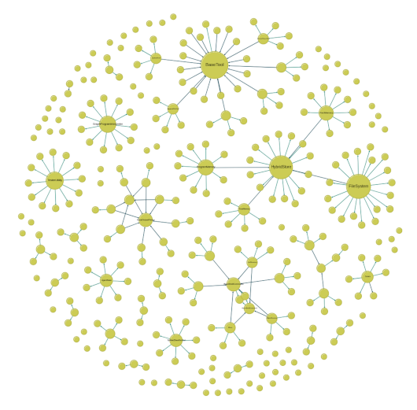

# Fact Memory
## HybridAGI triplet store

The Fact Memory allows the agent system to access a knowledge graph representing entities and their relations, enabling GraphRAGs and other knowledge-intensive applications. By indexing the entities, it enables the agent to search for a specific entity to answer questions or to verify facts.

This data structure is classical in knowledge-based systems like in robotics, biology or medecine. However, there is one drawback: the knowledge graphs are domain-specific, so the structure will vary significantly depending on your application. We provide some knowledge parsers to help you leverage this, but you will likely have to implement your own knowledge parser depending on your application.

<figure>
  <p align="center">
    
    <figcaption align="center"><b>Fig.1 - HybridAGI's fact memory indexes each entity, allowing graph augmented generation.</b></figcaption>
  </p>
</figure>

## Usage

```python
from hybridagi import ProgramMemory, FactMemory
from hybridagi import SentenceTransformerEmbeddings
from hybridagi.tools import (
    EntitySearch, # allows the system to search for entities
)

embeddings = SentenceTransformerEmbeddings(
    dim = 384,
    model_name_or_path = "sentence-transformers/all-MiniLM-L6-v2",
)

program_memory = ProgramMemory(
    index_name = "hybrid_agi", 
    embeddings = embeddings,
)

fact_memory = FactMemory(
    index_name = "hybrid_agi", # The global index
    embeddings = embeddings, # The embeddings to use
    graph_index = "fact_memory", # The hybridstore index (default to fact_memory)
    hostname = "localhost", # FalkorDB hostname (default to localhost)
    port = 6379, # FalkorDB port (default to 6379)
    username = "", # FalkorDB username (empty by default)
    password = "", # FalkorDB password (empty by default)
    indexed_label = "Entity", # The label of the indexed nodes (default to Entity)
    wipe_on_start = False, # Whether or not to wipe the hybridstore at start (default to False)
)

tools = [
    EntitySearch(
        fact_memory = fact_memory
    ),
]

interpreter = GraphProgramInterpreter(
    program_memory = program_memory,
    tools = tools,
)
```