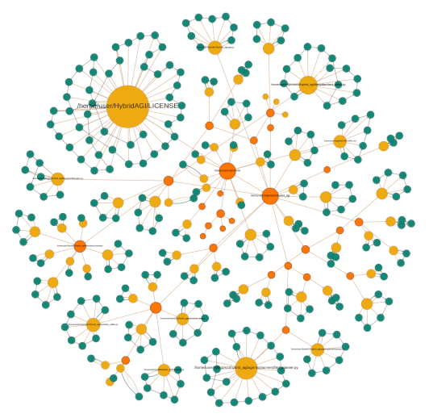

# File System
## HybridAGI document store

The File System is HybridAGI's document store, unlike vector-only databases, it preserves the structural integrity of the documents and folders. This allows the system to maintain the semantic separation between your documents.

When combined with the tools we provide, the agent can navigate inside this document store in a Unix-like fashion, enhancing its ability to efficiently search for and retrieve information.

<figure>
  <p align="center">
    
    <figcaption align="center"><b>Fig.1 - HybridAGI's long-term memory implements a file system-like structure of folders and files. This architecture enables the AI system to navigate and explore its vector store in a Unix-like fashion.</b></figcaption>
  </p>
</figure>

## Usage

```python
from hybridagi import ProgramMemory, FileSystem
from hybridagi import GraphProgramInterpreter
from hybridagi import SentenceTransformerEmbeddings
from hybridAGI import AgentState
# The tools to access the filesystem
from hybridagi.tools import (
    ReadFile, # Read document chunk by chunk
    WriteFile, # Write into a file (override if existing)
    AppendFile, # Append into a file (create one if non-existing)
    DocumentSearch, # Perform a similarity based search 
    InternalShell, # Use the Unix-like shell to navigate into the hybridstore and organize it
    Upload, # Zip and download a folder or file from the hybridstore
)

embeddings = SentenceTransformerEmbeddings(
    dim = 384,
    model_name_or_path = "sentence-transformers/all-MiniLM-L6-v2",
)

program_memory = ProgramMemory(
    index_name = "hybrid_agi", 
    embeddings = embeddings,
)

agent_state = AgentState()

filesystem = FileSystem(
    index_name = "hybrid_agi", # The global index
    embeddings = embeddings, # The embeddings to use
    graph_index = "filesystem", # The hybridstore index (default to filesystem)
    hostname = "localhost", # FalkorDB hostname (default to localhost)
    port = 6379, # FalkorDB port (default to 6379)
    username = "", # FalkorDB username (empty by default)
    password = "", # FalkorDB password (empty by default)
    indexed_label = "Content", # The label of the indexed nodes (default to Content)
    wipe_on_start = False, # Whether or not to wipe the hybridstore at start (default to False)
)

tools = [
    ReadFile(
        agent_state = agent_state,
        filesystem = filesystem,
    ),
    WriteFile(
        agent_state = agent_state,
        filesystem = filesystem
    ),
    AppendFile(
        agent_state = agent_state,
        filesystem = filesystem,
    ),
    DocumentSearch(
        filesystem = filesystem,
    ),
    InternalShell(
        agent_state = agent_state,
        filesystem = filesystem,
    ),
    Upload(
        filesystem = filesystem,
        # Where the system will save the zip archive (default to current working directory)
        downloads_directory = "~/Downloads",
    ),
]

agent = GraphProgramInterpreter(
    program_memory = program_memory,
    agent_state = agent_state,
    tools = tools,
)
```