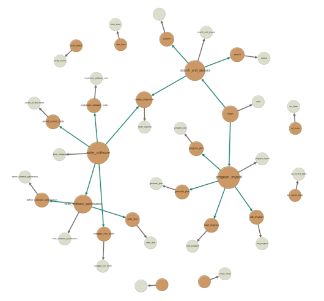

# Program Memory
## HybridAGI program store

The Program Memory is the only mandatory memory for our agent system. It is responsible for storing the dependency tree of the Cypher graph programs, along with the programs themselves. This memory enables the agent to read, write, and search for its own graph programs while safeguarding the main program and its dependencies from being modified by the system.

<figure>
  <p align="center">
    
    <figcaption align="center"><b>Fig.1 - HybridAGI's program memory implements the dependency tree of its prompt programs. This structure protects the main prompt program from being modified by the Agent system.</b></figcaption>
  </p>
</figure>

## Usage

```python
from hybridagi import ProgramMemory
from hybridagi import SentenceTransformerEmbeddings
from hybridagi.tools import (
    ReadProgram,
    WriteProgram,
    CallProgram,
    ProgramSearch,
)

embeddings = SentenceTransformerEmbeddings(
    dim = 384,
    model_name_or_path = "sentence-transformers/all-MiniLM-L6-v2",
)

program_memory = ProgramMemory(
    index_name = "hybrid_agi", # The global index
    embeddings = embeddings, # The embeddings to use
    graph_index = "program_memory", # The hybridstore index (default to program_memory)
    hostname = "localhost", # FalkorDB hostname (default to localhost)
    port = 6379, # FalkorDB port (default to 6379)
    username = "", # FalkorDB username (empty by default)
    password = "", # FalkorDB password (empty by default)
    indexed_label = "Content", # The label of the indexed nodes (default to Content)
    wipe_on_start = False, # Whether or not to wipe the hybridstore at start (default to False)
)

tools = [
    ReadProgram(
        program_memory = program_memory
    ),
    WriteProgram(
        program_memory = program_memory,
    ),
    CallProgram(
        program_memory = program_memory,
    ),
    ProgramSearch(
        program_memory = program_memory,
    ),
]

interpreter = GraphProgramInterpreter(
    program_memory = program_memory,
    tools = tools,
)
```