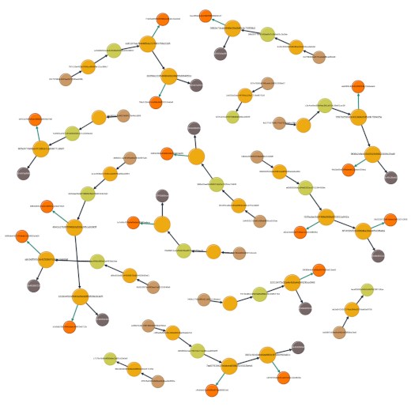

# Trace Memory
## HybridAGI trace store

The Trace Memory records every step of the interpreter and indexes every action, making it possible for the agent system to recall previous actions, similar to a human's episodic memory. It also allows for the inspection of the agent's trace using graph database inspection tools, enabling efficient debugging by using Cypher to search for information.

<figure>
  <p align="center">
    
    <figcaption align="center"><b>Fig.1 - HybridAGI's trace memory indexes each past action, allowing the AI system to recall past actions between sessions.</b></figcaption>
  </p>
</figure>

## Usage

```python
from hybridagi import ProgramMemory, TraceMemory
from hybridagi import SentenceTransformerEmbeddings
from hybridagi.tools import (
    PastActionSearch, # Allows the system to search for past actions
)

embeddings = SentenceTransformerEmbeddings(
    dim = 384,
    model_name_or_path = "sentence-transformers/all-MiniLM-L6-v2",
)

program_memory = ProgramMemory(
    index_name = "hybrid_agi", 
    embeddings = embeddings,
)

trace_memory = TraceMemory(
    index_name = "hybrid_agi", # The global index
    embeddings = embeddings, # The embeddings to use
    graph_index = "trace_memory", # The hybridstore index (default to trace_memory)
    hostname = "localhost", # FalkorDB hostname (default to localhost)
    port = 6379, # FalkorDB port (default to 6379)
    username = "", # FalkorDB username (empty by default)
    password = "", # FalkorDB password (empty by default)
    indexed_label = "Content", # The label of the indexed nodes (default to Content)
    wipe_on_start = False, # Whether or not to wipe the hybridstore at start (default to False)
)

tools = [
    PastActionSearch(
        trace_memory = trace_memory
    ),
]

interpreter = GraphProgramInterpreter(
    program_memory = program_memory,
    trace_memory = trace_memory,
    tools = tools,
)
```